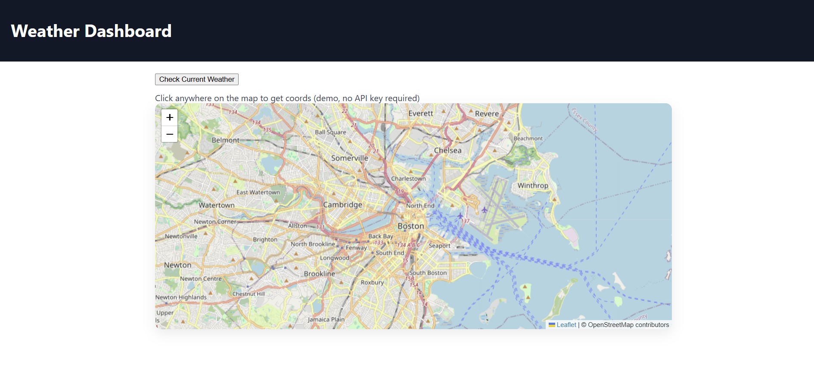

# Week 4 — JavaScript + Google Maps (Weather Dashboard) · `week4-sprint`
[](https://github.com/KatieBarnes147/week4-sprint/actions/workflows/secret-scan.yml)

Week 4 builds on the Week 3 Weather Dashboard by adding a map experience.  
The original assignment used the **Google Maps JavaScript API** and the **OpenWeather API** to let users click anywhere on the map and fetch real-time weather for that location.

---

## 🎯 Features
- Interactive map layer (Google Maps in the original assignment)
- Click map → capture latitude/longitude
- Fetch current weather from OpenWeather by coordinates
- Render results into the dashboard UI
- Responsive layout carried over from Week 3

---

## 🔧 Tech & APIs
- **Front-end:** HTML, CSS, JavaScript (static site in `/public`)
- **Map:** Google Maps JS API *(assignment)*  
  → For safe public demos, a **Leaflet/OpenStreetMap** page is included (`public/demo-leaflet.html`) so no API key is required.
- **Weather:** OpenWeather API

---

## 🚀 Run Locally (static site)
> No backend needed. This just serves the `/public` folder for local viewing.

```bash
# PowerShell
python -m http.server 5500 -d .\public
# then open: http://localhost:5500
If your Google Maps page shows an API error, that’s expected without a key.

For a key-free demo, open:
http://localhost:5500/demo-leaflet.html (Leaflet/OpenStreetMap).

🔑 API Keys (safe usage)
This repo is sanitized for public viewing—no real keys are committed.

Google Maps JS API: create your own key in Google Cloud and restrict by referrer (e.g., http://localhost:5500/* for local).
Put the key in a local copy of your HTML (do not commit keys).

OpenWeather: create a free key and keep it out of version control. For public demos, use placeholder text or the Leaflet demo page.

## 🖼️ Week 3 — Success


🗂️ Project Structure
bash
Copy code
.
├─ public/                  # static site (index.html, assets)
│  └─ demo-leaflet.html     # key-free demo page (Leaflet/OpenStreetMap)
├─ docs/
│  └─ week4-success.png     # screenshot used in the README
├─ .github/workflows/
│  └─ secret-scan.yml       # Gitleaks secret scanning on push/PR
└─ README.md
🔒 Security
Real secrets/keys are not committed.

The repo is scanned on every push/PR with Gitleaks (badge above).

If you add a local-only demo file containing a key, add it to .gitignore before committing.

🔗 Project Links
## 🔗 Links
**Live demo (GitHub Pages):** https://KatieBarnes147.github.io/week4-sprint/  
Key-free demo map: https://KatieBarnes147.github.io/week4-sprint/demo-leaflet.html

✍️ Author
Katie Barnes
GitHub: @KatieBarnes147
